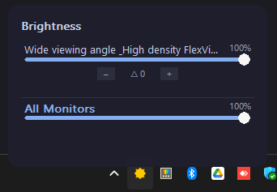
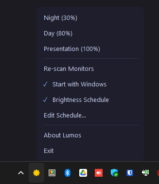
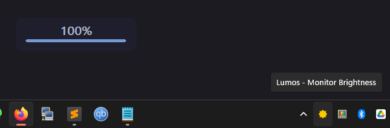

<div align="center">

# ☀️ Lumos

**One brightness control for every screen: external monitors over DDC/CI and the laptop panel over WMI, from the Windows tray.**

[](https://github.com/sfortis/lumos_ddc/releases/latest)
[](https://github.com/sfortis/lumos_ddc/releases)


</div>

---

## Table of Contents

- [What it does](#what-it-does)
- [Why Lumos?](#why-lumos)
- [Screenshots](#screenshots)
- [Features](#features)
- [How it works](#how-it-works)
- [Install](#install)
- [Usage](#usage)
- [Configuration](#configuration)
- [Requirements](#requirements)
- [Notes and limitations](#notes-and-limitations)
- [License](#license)

## What it does

Lumos is a tiny Windows system-tray utility that adjusts the hardware brightness of your monitors. It talks **DDC/CI** to external displays and uses the **WMI backlight** interface for internal laptop panels, so a single slider (or hotkey) dims everything at once: desktop monitors, a laptop screen, or a mixed setup.

Pure native Windows API and GDI, no runtime, no installer, no background bloat. One small 64-bit `.exe`.

## Why Lumos?

Windows can dim a laptop panel, but it will not touch the brightness of external monitors, and third-party tools are often heavy or cluttered.

| | Windows built-in | Lumos |
|---|:---:|:---:|
| Dim internal laptop panel | Yes | Yes |
| Dim external monitors (DDC/CI) | No | Yes |
| One control for all screens at once | No | Yes |
| Global hotkeys | No | Yes |
| Mouse-wheel over tray icon | No | Yes |
| Per-monitor offset (delta) | No | Yes |
| Time-of-day brightness schedule | No | Yes |
| Presets | No | Yes |
| Footprint | n/a | One ~480 KB exe, no deps |

## Screenshots

<p align="center">
  
  &nbsp;&nbsp;
  
</p>
<p align="center">
  
</p>

## Features

- **Dual backend** - External monitors via DDC/CI (dxva2), internal laptop panels via WMI, transparently in the same UI.
- **Tray popup** - Dark themed, per-monitor sliders plus an "All Monitors" master slider.
- **Global hotkeys** - `Ctrl+Alt+Up` / `Ctrl+Alt+Down` change brightness on all screens.
- **Mouse wheel on the tray icon** - Scroll over the tray icon to nudge brightness up or down.
- **Per-monitor delta** - Offset an individual monitor (-40..+40) so mismatched panels line up under the master slider.
- **Brightness schedule** - Optional time-of-day schedule that smoothly ramps brightness across the day (piecewise-linear, wraps around midnight). A manual change suspends it until the next anchor.
- **Idle auto-dim** - Optional. After a configurable idle period (default 5 minutes) the brightness drops to a configurable low level (default 5%), and it returns to the previous level as soon as you touch the keyboard or the mouse. Fullscreen video, presentation mode and live calls are skipped, so a movie you are watching or a Teams call you are sitting through without touching anything is not dimmed. Calls are detected by the microphone or the camera being in use, not by the name of the application, so any conferencing tool counts.
- **Presets** - Night, Day, and Presentation, with editable brightness values.
- **Settings window** - A dark themed screen for the brightness step, the idle dim level and timeout, the schedule and autostart switches, and the preset values. Right-click the tray icon and pick Settings.
- **On-screen display** - A clean overlay with the current percentage and a progress bar.
- **Auto-reconnect and restore** - Re-detects monitors on plug/unplug, session unlock, display power-on, and wake from sleep. Beyond recovering stale DDC handles, it re-applies your brightness (the schedule value, or the last master level) because displays often reset to full brightness across sleep or standby.
- **Autostart** - Optional launch at login.
- **Single instance with handoff** - Launching a newer build seamlessly takes over from the running one.

## How it works

Internal laptop panels do not answer DDC/CI (that is an I2C protocol meant for external displays); their backlight is driven through the embedded controller and exposed to Windows via WMI. Lumos gives each detected display the right backend automatically:

| Backend | Used for | API |
|---|---|---|
| **DDC/CI** | External monitors | `dxva2` (`GetMonitorBrightness` / `SetMonitorBrightness`) |
| **WMI** | Internal laptop panels | `root\WMI` (`WmiMonitorBrightnessMethods::WmiSetBrightness`) |

During enumeration each monitor is probed for DDC/CI first; if that fails, Lumos matches the display to its WMI panel by a normalized PnP instance key (never by hardcoded vendor or product IDs) and drives it over WMI instead. Everything above the backend (sliders, hotkeys, schedule, presets) is backend-agnostic.

## Install

1. Download the latest `lumos-vX.Y.Z.exe` from the [Releases](https://github.com/sfortis/lumos_ddc/releases/latest) page.
2. Run it. Lumos lives in the system tray (a small sun icon); there is nothing to install.
3. Optional: right-click the tray icon and enable **Start with Windows**.

### Build from source

Cross-compile from Linux/WSL with MinGW (outputs land in `build/`):

```bash
mkdir -p build
x86_64-w64-mingw32-windres lumos.rc -O coff -o build/lumos.res
x86_64-w64-mingw32-gcc -O2 -Wall -mwindows -DUNICODE -D_UNICODE \
  lumos.c monitor.c ui.c presets.c schedule.c wmibright.c capture.c build/lumos.res \
  -o build/lumos.exe \
  -ldxva2 -luser32 -lgdi32 -lshell32 -lcomctl32 -ladvapi32 -lole32 -loleaut32 -lwbemuuid -ldwmapi -lwtsapi32 -lkernel32 -lm
```

Or with MSVC from a Developer Command Prompt (also writes to `build/`):

```bat
build.bat            :: release
build.bat debug      :: debug build, logs to %APPDATA%\Lumos\lumos-*.log
```

## Usage

| Action | Result |
|---|---|
| **Left-click** tray icon | Open the brightness popup |
| **Right-click** tray icon | Context menu (presets, re-scan, settings, schedule, idle dim, autostart, exit) |
| **Mouse wheel** over tray icon | Brightness up / down by one step (default 5%) |
| `Ctrl+Alt+Up` / `Ctrl+Alt+Down` | Brightness up / down on all monitors |
| Drag a slider in the popup | Set that monitor; drag the master slider for all at once |
| Click the `-` / `+` on a monitor row | Adjust that monitor's delta offset |

## Configuration

Settings live in an INI file at:

```
%APPDATA%\Lumos\config.ini
```

It is created on first run. Everything in it can also be set from the interface: the Settings window covers the brightness step, the idle dim values, the schedule and autostart switches, and the preset brightness values, while the schedule points have their own editor (right-click tray icon > Edit Schedule). Preset names are the one thing that has to be edited in the file, because the interface has no text input.

```ini
[Presets]
Night=30
Day=80
Presentation=100

[Settings]
Step=5
ScheduleEnabled=0
IdleDimEnabled=0
IdleDimPercent=5
IdleDimMinutes=5

[Schedule]
07:00=60
12:00=100
19:00=70
23:00=25
```

In the Settings window a value changes by clicking its `-` and `+` buttons or by scrolling the wheel over the row, a switch flips by clicking it, and nothing is written until you press Save. Clicking outside the window cancels.

The idle auto-dim keys work together. `IdleDimEnabled` turns the feature on and off, and the tray context menu toggles the same key. `IdleDimPercent` is the level held while the session is idle (0 to 100). `IdleDimMinutes` is how long there must be no keyboard or mouse input before the dim happens (1 to 1440 minutes).

## Requirements

- Windows 10 or 11 (64-bit).
- For external monitors: a display and cable/connection that support **DDC/CI**, with DDC/CI enabled in the monitor's OSD menu. Most monitors support it; some cheap or very old ones do not.
- For laptop panels: a standard WMI-controllable backlight (the same one Windows' own brightness slider uses). Works on the vast majority of laptops.

## Notes and limitations

- A few external monitors report DDC/CI capability but respond poorly; if a slider has no effect, check that DDC/CI is enabled in the monitor's menu.
- Settings are stored in `%APPDATA%\Lumos\config.ini`.
- Some KVM switches or docking stations block DDC/CI passthrough.
- Idle auto-dim is not a substitute for turning the display off. On an LCD, image retention is temporary and burn-in is not really a risk. On an OLED, a lower backlight level slows pixel wear but does not stop it, because the content stays static. Use the Windows power plan to switch the display off for real protection.

## License

No license has been specified for this project. All rights reserved by the author.
