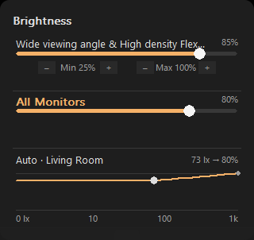
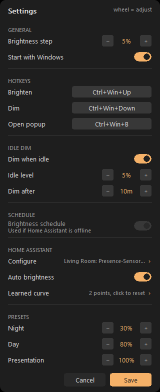
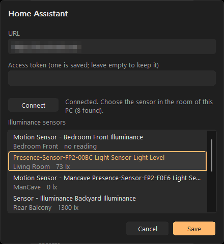

<div align="center">

# ☀️ Lumos

**One brightness control for every screen: external monitors over DDC/CI and the laptop panel over WMI, from the Windows tray.**

[](https://github.com/sfortis/lumos_ddc/releases/latest)
[](https://github.com/sfortis/lumos_ddc/releases)


</div>

---

## Table of Contents

- [What it does](#what-it-does)
- [Why Lumos?](#why-lumos)
- [Screenshots](#screenshots)
- [Features](#features)
- [How it works](#how-it-works)
- [Install](#install)
- [Usage](#usage)
- [Auto brightness with Home Assistant](#auto-brightness-with-home-assistant)
- [Keyboard and screen readers](#keyboard-and-screen-readers)
- [Command line](#command-line)
- [Configuration](#configuration)
- [Requirements](#requirements)
- [Notes and limitations](#notes-and-limitations)
- [License](#license)

## What it does

Lumos is a small Windows system-tray utility that adjusts the hardware brightness of your monitors. It talks **DDC/CI** to external displays and uses the **WMI backlight** interface for internal laptop panels, so a single slider or hotkey dims everything at once: desktop monitors, a laptop screen, or a mixed setup.

It is written against the native Windows API and GDI, with no runtime and no installer. The app is one 64-bit `.exe` of about 200 KB, and an optional companion, `lumosctl.exe`, controls it from the command line.

## Why Lumos?

Windows can dim a laptop panel, but it will not touch the brightness of external monitors, and third-party tools are often heavy or cluttered.

| | Windows built-in | Lumos |
|---|:---:|:---:|
| Dim internal laptop panel | Yes | Yes |
| Dim external monitors (DDC/CI) | No | Yes |
| One control for all screens at once | No | Yes |
| Global hotkeys | No | Yes, configurable |
| Mouse wheel over the tray icon | No | Yes |
| Per-monitor brightness range | No | Yes |
| Time-of-day brightness schedule | No | Yes |
| Dim when idle | No | Yes |
| Auto brightness from a Home Assistant light sensor | No | Yes, learns your preference |
| Command line control | No | Yes |
| Footprint | n/a | One ~200 KB exe, no dependencies |

## Screenshots

<p align="center">
  
  &nbsp;&nbsp;
  
</p>
<p align="center">
  
  &nbsp;&nbsp;
  
</p>

## Features

- **Dual backend** - External monitors are driven over DDC/CI (dxva2) and internal laptop panels over WMI, in the same interface.
- **Tray popup** - A dark popup with a slider for each monitor and an "All Monitors" slider that moves them together.
- **Per-monitor range** - Each monitor has a minimum and a maximum: its level when All Monitors is at 0% and at 100%. All Monitors moves every monitor linearly across its own range, so two monitors matched at both ends stay matched in between, and every step moves every monitor. The maximum is set with the `-` / `+` under the monitor in the popup and the minimum in Settings. Offsets from older versions are converted automatically.
- **Global hotkeys** - `Ctrl+Win+Up` / `Ctrl+Win+Down` change the brightness of all screens, and `Ctrl+Win+B` opens the popup. All three can be changed in Settings. An installation upgraded from 1.1 or older keeps the `Ctrl+Alt+Up` / `Ctrl+Alt+Down` it had.
- **Mouse wheel on the tray icon** - Scrolling over the tray icon moves the brightness up or down by one step.
- **On-screen display** - A hotkey or wheel change shows an overlay with the All Monitors level and a progress bar.
- **Keyboard and screen reader access** - The tray icon, the popup, the menu, Settings and About work entirely from the keyboard, and NVDA and Narrator can read their controls. With NVDA, a hotkey or wheel change is spoken even while another application has the focus. The schedule editor is not covered yet.
- **Brightness schedule** - An optional time-of-day schedule that ramps the brightness smoothly between the points you set, wrapping around midnight. A manual change pauses it until the next point.
- **Idle auto-dim** - Optional. After a period without keyboard or mouse input (default 5 minutes) the brightness drops to a low level (default 5%), and it comes back as soon as you touch the keyboard or the mouse. Lumos does not dim during fullscreen video, presentation mode, or while the microphone or the camera is in use, so a video call is not dimmed whatever application it runs in.
- **Auto brightness from a light sensor** - Optional. Lumos reads an illuminance sensor from your Home Assistant server and sets the All Monitors level from the light in the room. When you change the brightness yourself, Lumos remembers that level for that light, so the curve learns what you like. See [Auto brightness with Home Assistant](#auto-brightness-with-home-assistant).
- **Presets** - Night, Day and Presentation, with editable brightness values.
- **Command line** - `lumosctl.exe` sets, raises, lowers and reads the brightness of all monitors or one of them, applies presets, and switches the schedule and idle dim, through the running Lumos.
- **Settings window** - A dark window for the brightness step, the hotkeys, idle dim, the schedule and autostart switches, Home Assistant auto brightness, the minimum of each monitor, and the preset values.
- **Reconnect and restore** - Lumos detects the monitors again after a plug or unplug, an unlock, a display power-on and a wake from sleep, and re-applies your brightness, because displays often reset to full brightness across sleep. An external monitor often wakes a few seconds after the laptop panel and does not answer DDC/CI at first. Lumos then shows it as **Unavailable**, keeps the other screens working, and tries again after 2, 5, 10 and 20 seconds and then every minute until the monitor answers. The same retry runs when Lumos starts while a known monitor is still off.
- **Autostart** - Optional launch at login.
- **Single instance with handoff** - Starting a newer build takes over from the one that is running.

## How it works

Internal laptop panels do not answer DDC/CI, which is an I2C protocol meant for external displays. Their backlight is driven through the embedded controller and exposed to Windows through WMI. Lumos picks the right backend for each display automatically:

| Backend | Used for | API |
|---|---|---|
| **DDC/CI** | External monitors | `dxva2` (`GetMonitorBrightness` / `SetMonitorBrightness`) |
| **WMI** | Internal laptop panels | `root\WMI` (`WmiMonitorBrightnessMethods::WmiSetBrightness`) |

During detection, Lumos first tries to read each monitor's brightness over DDC/CI. If that fails, it matches the display to its WMI panel by the PnP instance key (never by hardcoded vendor or product IDs) and drives it over WMI instead. Everything above the backend, such as the sliders, hotkeys, schedule and presets, works the same for both.

## Install

1. Download `lumos-vX.Y.Z.exe` from the [Releases](https://github.com/sfortis/lumos_ddc/releases/latest) page, and `lumosctl.exe` too if you want the command line tool.
2. Run it. Lumos lives in the system tray as a small sun icon; there is nothing to install.
3. Optional: right-click the tray icon and enable **Start with Windows**.

### Build from source

Cross-compile from Linux or WSL with MinGW. The outputs go to `build/`.

```bash
make            # build/lumos.exe and build/lumosctl.exe
make test       # build and run the unit tests with the native gcc
make debug      # build/lumos-debug.exe, logs to %APPDATA%\Lumos\lumos-*.log
```

The source code is in `src/`, the unit tests are in `tests/`, and the icon and the resource script are in `res/`.

Or with MSVC from a Developer Command Prompt (this also writes to `build/`):

```bat
build.bat            :: release
build.bat debug      :: debug build, logs to %APPDATA%\Lumos\lumos-*.log
```

## Usage

| Action | Result |
|---|---|
| **Left-click** the tray icon | Open the brightness popup |
| **Right-click** the tray icon | Open the menu: presets, re-scan, Settings, autostart, schedule, idle dim, auto brightness, About, exit |
| **Mouse wheel** over the tray icon | Brightness up or down by one step (default 5%) |
| `Ctrl+Win+Up` / `Ctrl+Win+Down` | Brightness up or down on all monitors |
| `Ctrl+Win+B` | Open the brightness popup with keyboard focus |
| Drag a slider in the popup | Set that monitor, or all of them with the All Monitors slider |
| Click `-` / `+` under a monitor | Change that monitor's maximum, its level at All Monitors 100% |

To match two monitors, set All Monitors to 100% and change the maximum of the brighter monitor until both look the same. Then set All Monitors to 0% and, in Settings, raise the minimum of the monitor that is darker at 0% until they match again.

## Auto brightness with Home Assistant

If you run [Home Assistant](https://www.home-assistant.io/) and have an illuminance sensor in the room, Lumos can follow the light in that room. It reads the sensor every 15 seconds and sets the All Monitors level from it, so the screens get brighter when the room does and dimmer when it gets dark. The feature is off until you set it up.

### Setting it up

1. In Home Assistant, create a long-lived access token (your profile, Security tab). A non-admin user is enough, and a dedicated user for Lumos is a good idea.
2. Open Settings in Lumos and click **Light sensor** in the HOME ASSISTANT section. The Home Assistant window opens.
3. Enter the address of your server (for example `https://homeassistant.local:8123`) and paste the token, then press **Connect**.
4. Lumos lists every sensor whose device class is illuminance, with its area and its current reading. Choose the sensor in the room of this PC and press **Save**.
5. Turn on **Auto brightness** in Settings, or choose **Auto Brightness (Light Sensor)** in the tray menu. That menu item appears once a sensor is chosen.

<p align="center">
  
</p>

The Home Assistant window stays open when you click elsewhere, so you can copy the token from a browser. Cancel, Save and `Esc` close it.

### How the level is chosen

A curve turns the light into a brightness level. Until it learns anything, the curve is 20% at 0 lx, 40% at 10 lx, 70% at 100 lx and 100% at 1000 lx, and the level is interpolated on a logarithmic scale between those points, because the eye judges light by ratios.

When you change the brightness yourself while auto brightness is on (a hotkey, the mouse wheel, a slider, a preset or `lumosctl`), Lumos keeps your level and adds it to the curve as the level you want at the current light. The first learned point is added to the four default points, and the curve holds at most eight points in total. A new point replaces one at a similar light level, and points that would make the screens darker as the room gets brighter are removed. To start over, click **Learned curve** in Settings and press Save.

Many indoor sensors report small random changes in a dark room, for example 0, 5 and 8 lx. Lumos smooths the readings so the screens do not change every few minutes because of that noise. A clear change, such as a lamp switched on, is applied once a second reading 3 seconds later confirms it, so the screens follow it within about 5 to 20 seconds. The level then moves 1% every 100 milliseconds instead of jumping, so the screens fade to the new level (from 85% to 40% takes about 4.5 seconds). A change you make yourself, and the restore after a wake, are applied at once.

### The popup panel

Once a sensor is chosen, the popup shows a panel under the sliders with the area of the sensor, its current reading as Home Assistant shows it, and the level Lumos set for it. A small chart shows the curve, the learned points and a dot for the light now. While a change waits for confirmation, the panel says "adjusting...". Screen readers read the panel as one line of text.

### When Home Assistant does not answer

The brightness schedule is paused while auto brightness controls the level. While auto brightness is on, the schedule switch in Settings and the two schedule items in the tray menu are greyed out, and Settings says that the schedule is used if Home Assistant is offline. When Home Assistant does not answer six polls in a row (a minute and a half), the panel says "Home Assistant offline" and the schedule takes over until Home Assistant answers again. A sensor that reports "unavailable" keeps the level of its last reading.

### The token

The token is stored in `config.ini` encrypted with Windows DPAPI, so only your Windows account on this PC can read it. Copying `config.ini` to another account or another PC leaves the token behind, and Lumos asks for it again. When you change the address, Lumos does not send the saved token to the new address and asks for the token again. Certificates are always checked. An `http://` address works, but the window shows a red warning, because the token then travels unencrypted.

## Keyboard and screen readers

The tray icon, the popup, the menu, Settings, the Home Assistant window and About can be used without a mouse, and they expose their controls to screen readers through Microsoft Active Accessibility. These windows are drawn by Lumos itself rather than built from standard Windows controls, so this support is part of each window and not something Windows supplies on its own. The schedule editor does not have keyboard or screen reader support yet.

To reach the tray icon, press `Win+B` and move to the Lumos icon with the arrow keys. `Enter` or `Space` opens the popup, and `Shift+F10` or the Menu key opens the menu. The `Ctrl+Win+B` hotkey opens the popup directly.

| Window | Keys |
|---|---|
| Popup | `Tab` / `Shift+Tab` move between the sliders and the monitor maximums. The arrow keys change the value by 1 (`Up` and `Right` raise it), `Page Up` / `Page Down` change a slider by 10 and a maximum by 5, and `Home` / `End` jump to the limits. `Esc` closes. |
| Menu | `Up` / `Down` move, `Home` / `End` jump to the first or last item, a letter jumps to the next item that starts with it, `Enter` or `Space` chooses, and `Esc` closes. |
| Settings | `Tab`, `Shift+Tab`, `Up` and `Down` move between rows and the buttons. `Left` / `Right` change a number or flip a switch, and `Space` flips a switch. `Enter` on a hotkey row starts recording a new combination, on the Light sensor or Learned curve row it does what a click does, and anywhere else it saves. `Esc` closes without saving. |
| Home Assistant | The window is built from standard Windows text fields, buttons and a list. `Tab` and `Shift+Tab` move between them, the arrow keys choose a sensor in the list, and `Esc` closes without saving. |
| About | `Enter` opens the project page and `Esc` closes. |

To change a hotkey, focus its row in Settings, press `Enter`, and press the new combination. A hotkey needs `Ctrl`, `Alt` or `Win`. While a row is recording, `Esc` cancels and `Backspace` turns the hotkey off. If another program already uses the combination, Save leaves the window open and the row says "In use by another app". The `Ctrl+Alt+Up` / `Ctrl+Alt+Down` hotkeys of upgraded installations are also the table navigation commands of NVDA and JAWS, so screen reader users should change them.

When a hotkey or the mouse wheel changes the brightness, the on-screen display announces the All Monitors level ("Brightness 45%") as a live region. NVDA reads it even while another application has the focus. Narrator does not, because it ignores announcements from applications in the background; with Narrator, open the popup (`Ctrl+Win+B`) to hear the current level. While the popup is open, the focused slider reports every change.

## Command line

`lumosctl.exe` controls the running Lumos from a terminal, a script or a shortcut. Put it next to `lumos.exe` or anywhere on your `PATH`. It talks to Lumos, so Lumos has to be running.

```
lumosctl --set 40                 All Monitors to 40%, each monitor within its range
lumosctl --up                     one brightness step up (--down for down)
lumosctl --down 10                10% down
lumosctl --get                    print the current levels
lumosctl --list                   list the monitors with their numbers and ranges
lumosctl --set 60 --monitor 2     one monitor only, by number from --list
lumosctl --up -m dell             or by a name, or a unique part of it
lumosctl --preset Night           apply a preset
lumosctl --schedule off           turn the schedule on or off
lumosctl --idle-dim on            turn dim when idle on or off
lumosctl --rescan                 look for monitors again
```

Every command prints its result, which also makes it usable with a screen reader in a terminal. Changes from the command line count as manual changes, so they pause the schedule until its next point, and they do not show the on-screen display. While auto brightness is on, a change from the command line becomes a point of the learned curve instead, like any other manual change.

The exit code is 0 when the command worked, 1 for wrong usage, 2 when Lumos is not running, 3 when the command failed (an unknown preset or monitor, for example), and 4 when Lumos did not answer.

## Configuration

Settings live in an INI file that is created on the first run:

```
%APPDATA%\Lumos\config.ini
```

Almost everything in it can be set from the interface. Settings covers the brightness step, the hotkeys, idle dim, the schedule and autostart switches, Home Assistant auto brightness, the monitor minimums and the preset values. The popup sets the monitor maximums, and the schedule points have their own editor (right-click the tray icon, then Edit Schedule). Preset names are the one thing that has to be edited in the file, because the interface has no text input.

```ini
[Presets]
Night=30
Day=80
Presentation=100

[Settings]
Step=5
Autostart=0
ScheduleEnabled=0
IdleDimEnabled=0
IdleDimPercent=5
IdleDimMinutes=5
HotkeyBrighten=Ctrl+Win+Up
HotkeyDim=Ctrl+Win+Down
HotkeyPopup=Ctrl+Win+B

[Schedule]
07:00=60
12:00=100
19:00=70
23:00=25

[Ranges]
DELL U2414H=0,60
Wide viewing angle & High density FlexView Display 1920x1080=40,100

[HomeAssistant]
Url=https://homeassistant.local:8123
Token=AQAAANCMnd8BFdERjHoAwE/Cl+sBAAAA...
Sensor=sensor.living_room_illuminance
SensorLabel=Living Room: Illuminance
AutoBrightness=1
Curve=0:20,10:40,77:85,1000:100
```

In Settings, a number changes with its `-` and `+` buttons or with the mouse wheel over the row, a switch flips when you click it, and nothing is written until you press Save. Cancel, `Esc` or a click outside the window closes it without saving. The schedule editor has the same buttons and closes the same way. Both windows can be moved by dragging any spot that is not a control.

Hotkeys are stored as text. Modifiers are `Ctrl`, `Alt`, `Shift` and `Win`, and keys are letters, digits, `F1` to `F24`, the arrows, `Home`, `End`, `PageUp`, `PageDown`, `Insert`, `Delete`, `Space`, `Enter`, `Tab`, `Backspace`, `Pause` and the numeric keypad (`Num0` to `Num9`, `NumPlus`, `NumMinus`, `NumMultiply`, `NumDivide`, `NumDecimal`). `None` turns a hotkey off, and a value that cannot be read falls back to the default. A `config.ini` from version 1.1 or older has no hotkey lines, and it keeps the `Ctrl+Alt+Up` / `Ctrl+Alt+Down` brightness hotkeys those versions used.

Each line in `[Ranges]` is a monitor name followed by its minimum and maximum, the levels it takes when All Monitors is at 0% and at 100%. A second monitor with the same name is stored as `Name #2`, so two identical models keep separate ranges. A range is at least 20 points wide, so every brightness step still moves the monitor. A monitor without a line starts at `0,100`. A `config.ini` from an older version has a `[Deltas]` section with one offset per monitor instead. Lumos converts those offsets into ranges that keep the monitors matched the same way (offsets of +10 and -30 become `40,100` and `0,60`), and it leaves `[Deltas]` untouched so an older version still finds its offsets.

The `[HomeAssistant]` section is written by the Home Assistant window and by Settings. `Token` is encrypted for your Windows account and cannot be typed in by hand. `Sensor` is the entity id and `SensorLabel` is the "Area: Name" text shown in Settings. `Curve` holds the points of the curve as `lux:level` pairs, the default points that are left together with the learned ones, and an empty value means the default curve.

`IdleDimEnabled` turns idle dim on and off, and the tray menu toggles the same key. `IdleDimPercent` is the level held while the session is idle (0 to 100). `IdleDimMinutes` is how long there must be no keyboard or mouse input before the dim happens (1 to 1440 minutes).

## Requirements

- Windows 10 or 11 (64-bit).
- For external monitors: a display and a connection that support **DDC/CI**, with DDC/CI enabled in the monitor's own menu. Most monitors support it; some cheap or very old ones do not.
- For laptop panels: a standard WMI-controllable backlight, the same one the Windows brightness slider uses. Most laptops have one.
- For auto brightness (optional): a Home Assistant server that this PC can reach, and an illuminance sensor in the room.

## Notes and limitations

- A few external monitors report DDC/CI support but respond poorly. If a slider has no effect, check that DDC/CI is enabled in the monitor's menu.
- A monitor that stays **Unavailable** does not answer DDC/CI. Lumos keeps retrying a monitor that has answered before, also when Lumos starts while that monitor is off. A monitor that never answered (DDC/CI turned off in its menu, or a dock that blocks it) is not retried until the next plug, unlock or manual re-scan.
- A Home Assistant token of a user marked "local access only" works only on your home network or over a VPN. Away from it, Home Assistant refuses the token in the same way as a wrong one, so Lumos reports a refused token and the schedule takes over.
- Some KVM switches and docking stations block DDC/CI.
- Idle auto-dim is not a substitute for turning the display off. On an LCD, image retention is temporary and burn-in is not really a risk. On an OLED, a lower brightness slows pixel wear but does not stop it, because the content stays static. Use the Windows power plan to switch the display off for real protection.

## License

No license has been specified for this project. All rights reserved by the author.
